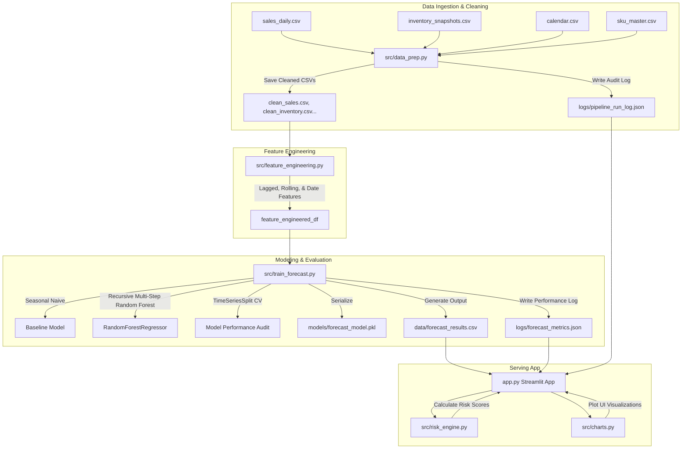
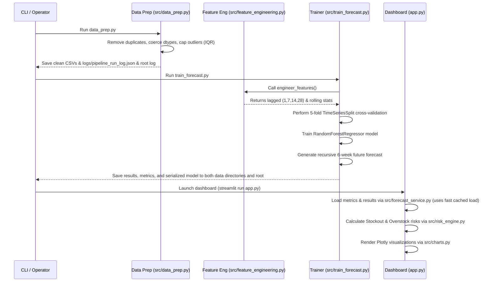

# Project FORESIGHT: Demand & Inventory Intelligence


[](https://www.python.org/)
[](https://streamlit.io/)
[](LICENSE)
[](https://pep8.org/)

A weekly demand forecasting and stockout/overstock early-warning decision system developed for **NorthBay Living**, a direct-to-consumer home & lifestyle brand.

---

## 📌 Project Overview
NorthBay Living plans inventory based on spreadsheets and intuition, leading to costly stockouts on bestsellers and capital locked up in slow-moving overstock. Project FORESIGHT resolves this by building a reproducible, data-driven pipeline that provides:
1. **Weekly SKU-level demand forecasts** over a 6-week horizon.
2. **Multi-factor risk scoring** (incorporating lead times, demand momentum, and promotion sensitivity).
3. **Quadrant-based operational recommendations** (`REORDER NOW`, `MARKDOWN / CLEAR`, `WATCH / VOLATILE`, `HEALTHY`).
4. **Quantified financial impacts** (Rupees at risk and capital locked in excess holdings).

---

## 🛠️ Feature List & Tech Stack

### Key Features
- **Data Cleaning & Auditing**: Automatic deduplication, type validation, range checking, IQR-based outlier capping, and revenue consistency verification.
- **Advanced Feature Engineering**: Generates 15 time-series features (including daily lags 1, 7, 14, 28, rolling window statistics, day of week, week number, month, quarter, holidays, promotions, and weekend flags).
- **Weekly Demand Forecasting**: Chronological demand aggregation and recursive multi-step forecasting with a Random Forest Regressor.
- **Chronological Validation**: Time-series cross-validation (`TimeSeriesSplit`) to prevent look-ahead bias and leakage.
- **Early-Warning Risk Engine**: Stockout risk, overstock risk, and operational decision quadrants based on lead times and demand velocity.
- **Interactive Decision Dashboard**: Interactive Plotly visualizations showing risk matrix scatter plots, actual demand vs. baseline/ML forecasts, and SKU-level inventory position gauges.

### Technology Stack
- **Languages**: Python (Type hints & docstrings included)
- **Machine Learning**: Scikit-Learn (Random Forest Regressor), Joblib
- **Data Analysis**: Pandas, NumPy
- **Visualizations**: Plotly, Streamlit
- **Quality Assurance**: Unittest

---

## 🏗️ Architecture & Solution Design

### 1. System Architecture


### 2. Pipeline Sequence Workflow


---

## 🖼️ Dashboard Screenshots Section

Below are placeholders for the dashboard screens:
- **Executive Decision Board & Risk Matrix**: Plots every SKU on a stockout vs. overstock bubble grid (where bubble size represents the financial value at stake) and shows prioritized action tables.
  
- **SKU Deep Dive**: Displays historical weekly sales alongside model predictions, confidence bands, and current inventory position gauges.
  

*(To save screenshots, run the Streamlit app locally, capture pages, and place them under `reports/images/`)*

---

## 📂 Repository Structure
```text
Project-FORESIGHT/
├── data/                       # CSV extracts (raw + clean)
│   ├── calendar.csv            # Raw Date and seasonal features
│   ├── inventory_snapshots.csv  # Raw Inventory snapshots
│   ├── sales_daily.csv         # Raw Sales daily transactions
│   ├── sku_master.csv          # Raw SKU metadata
│   ├── clean_sales.csv         # Cleaned sales data
│   ├── clean_inventory.csv     # Cleaned inventory data
│   ├── clean_calendar.csv      # Cleaned calendar data
│   ├── clean_sku_master.csv    # Cleaned product data
│   ├── forecast_results.csv    # Merged historical + forecast predictions (under data/)
│   └── logs/
│       ├── forecast_metrics.json   # Accuracy metrics (under data/logs/)
│       └── pipeline_run_log.json   # Processing statistics (under data/logs/)
├── logs/
│   ├── app.log                 # Streamlit application log file
│   └── forecast_metrics.json   # Project-level metrics backup
├── models/
│   └── forecast_model.pkl      # Serialized model assets (under models/)
├── src/                        # Modular Source Code
│   ├── charts.py               # Plotly dashboard visualizations
│   ├── config.py               # Paths, files, and styles config
│   ├── data_prep.py            # Data prep & validation module
│   ├── feature_engineering.py  # Lag, rolling, & calendar features generator
│   ├── forecast_service.py     # Streamlit data loader & service layer
│   ├── risk_engine.py          # Dashboard multi-factor risk scoring engine
│   ├── train_forecast.py       # Model training, validation, & forecast pipeline
│   └── utils.py                # Currency formatting & logging setup
├── tests/                      # Automated Verification
│   └── test_pipeline.py        # Module integration and zero-division tests
├── app.py                      # Interactive Streamlit dashboard
├── forecast_results.csv        # Root-level results file (deliverable)
├── forecast_metrics.json       # Root-level metrics file (deliverable)
├── forecast_model.pkl          # Root-level model file (deliverable)
├── pipeline_run_log.json       # Root-level prep run log file (deliverable)
├── FINAL_REPORT.md             # Complete project portfolio report
├── FINAL_QA_REPORT.md          # Final quality assurance validation report
├── LICENSE                     # MIT License
├── requirements.txt            # Python dependencies
└── README.md                   # Project documentation
```

---

## 📈 Success Metrics, KPIs, & Results

To evaluate forecast accuracy against a **seasonal-naive baseline** (representing sales from 52 weeks / 364 days ago), the pipeline tracks:
*   **WAPE (Weighted Absolute Percentage Error)**: Primary accuracy metric.
    \[
    \text{WAPE} = \frac{\sum |Actual - Forecast|}{\sum Actual}
    \]
*   **MAE & RMSE**: Mean Absolute Error & Root Mean Squared Error.
*   **Forecast Bias**: Evaluates systematic over- or under-forecasting.
    \[
    \text{Bias} = \frac{\sum (Forecast - Actual)}{\sum Actual}
    \]

### Evaluation Results (Backtest Period: Nov 20, 2025 – Dec 31, 2025)

Our trained **Random Forest** model achieves a backtest **WAPE of 9.86%**, showing a **+13.60% improvement** in forecast accuracy over the Seasonal Naive baseline (WAPE of 23.46%).

| Metric | Seasonal-Naive Baseline | Random Forest ML Model |
| :--- | :--- | :--- |
| **WAPE** | 23.46% | **9.86%** |
| **MAE** | 3.97 | **1.67** |
| **RMSE** | 5.80 | **2.54** |
| **Bias** | -2.32% | **+0.33%** |

---

## 🛠️ Environment Setup & Quickstart

### 1. Set Up Virtual Environment
Create and activate a virtual environment to manage dependencies:
```bash
# Windows (PowerShell)
python -m venv venv
venv\Scripts\activate.ps1

# macOS/Linux
python3 -m venv venv
source venv/bin/activate
```

### 2. Install Dependencies
```bash
pip install -r requirements.txt
```

### 3. Run Data Engineering & Forecasting Pipeline
Before launching the app, run the preprocessing and training scripts to populate forecasting data:
```bash
# 1. Clean and validate raw datasets
python src/data_prep.py

# 2. Train Random Forest models and forecast 6 weeks out
python src/train_forecast.py
```

### 4. Run the Streamlit Dashboard
Launch the interactive dashboard:
```bash
streamlit run app.py
```

### 5. Run Automated Tests
Execute the unit tests to verify the pipeline components and zero-division safety:
```bash
python -m unittest discover -s tests
```

---

## 🚀 Streamlit Cloud Deployment Compatibility
The codebase is designed for seamless deployment on the **Streamlit Community Cloud**:
1. Push this repository to your GitHub account.
2. Sign in to [Streamlit Share](https://share.streamlit.io/).
3. Click **New app**, select your repository, branch, and set the entry file to `app.py`.
4. The application reads from the root-level deliverables (`forecast_results.csv` and `forecast_metrics.json`), which are pre-trained and committed. This ensures the dashboard loads instantly on startup without requiring execution of the training pipeline on Streamlit's resource-constrained sandbox.

---

## 🔮 Future Improvements
1. **Dynamic Lead Time Integration**: Connect with shipping and carrier APIs to update lead times dynamically.
2. **Promotional Planning Controls**: Enable operators to input planned promo schedules directly into the dashboard to dynamically shift forecast curves.
3. **Deep Learning Sequence Models**: Evaluate sequence models such as Temporal Fusion Transformers (TFT) or LSTMs to improve performance on highly sparse SKU sales.

---

## 📄 License
This project is licensed under the MIT License - see the [LICENSE](LICENSE) file for details.
